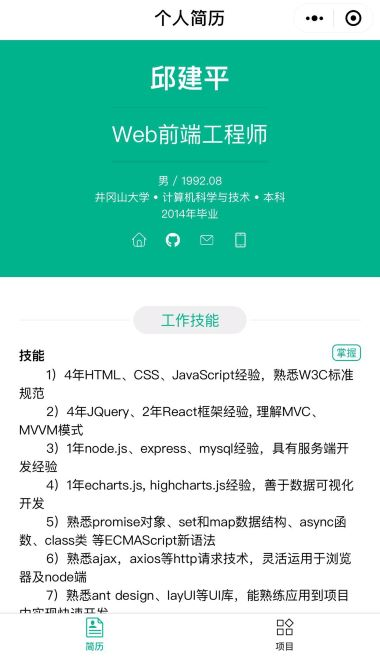
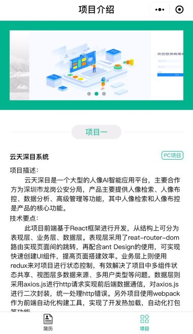

# 微信小程序简历

用微信开发者工具做的微信小程序，没有使用任何其它框架

## 效果演示

微信搜索 『**李洋的个人简历**』，或者直接扫码

### 小程序界面截图

## 学习网址

[微信小程序教程](https://developers.weixin.qq.com/miniprogram/dev/index.html)  学习小程序网站，由腾讯官方提供。

[微信小程序示例源码](https://github.com/wechat-miniprogram/miniprogram-demo.git)     github上的组件demo，可以优先体验后再学习。

[阿里矢量图库](http://iconfont.cn/)     非常好看的图标库，非常全面。

## 前方有坑

（1）没有 p、span 标签，基本上有文字的地方都用 text标签，view 是块级标签，text 是行级标签

（2）个人小程序不支持外部网页跳转

